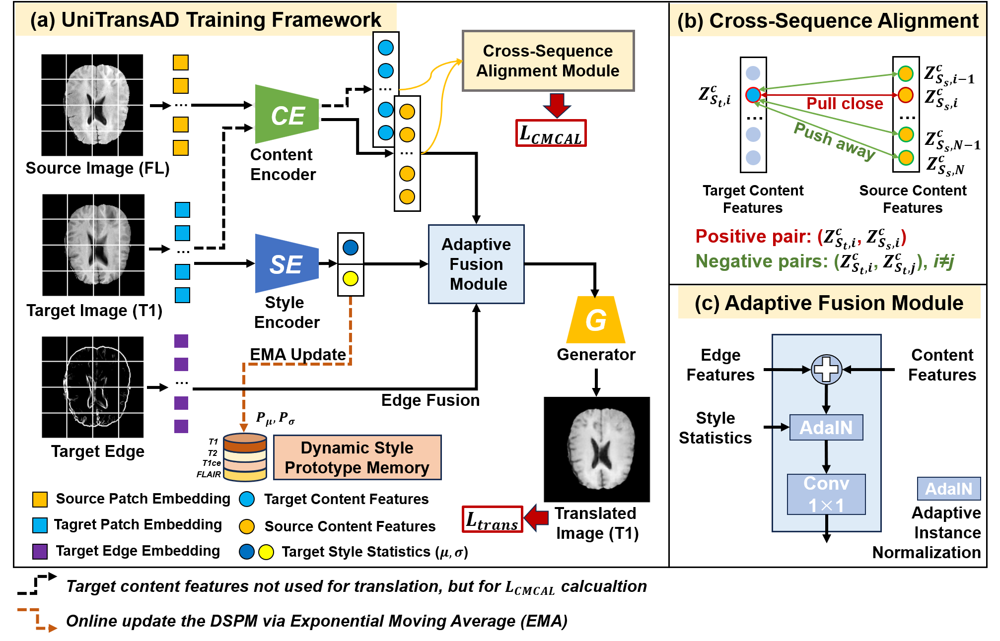
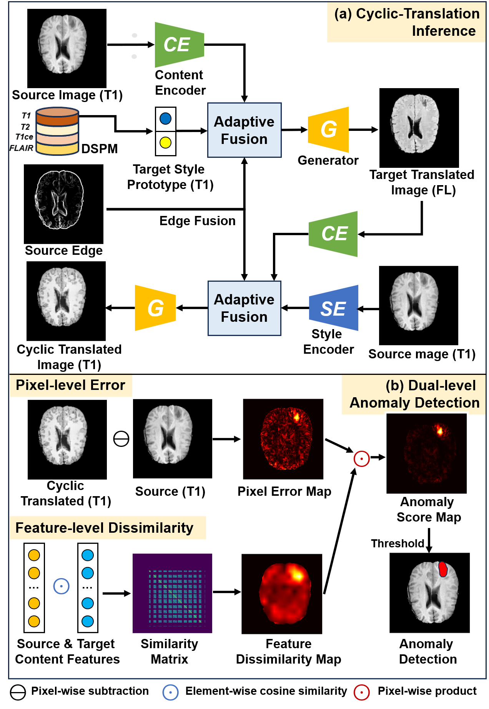
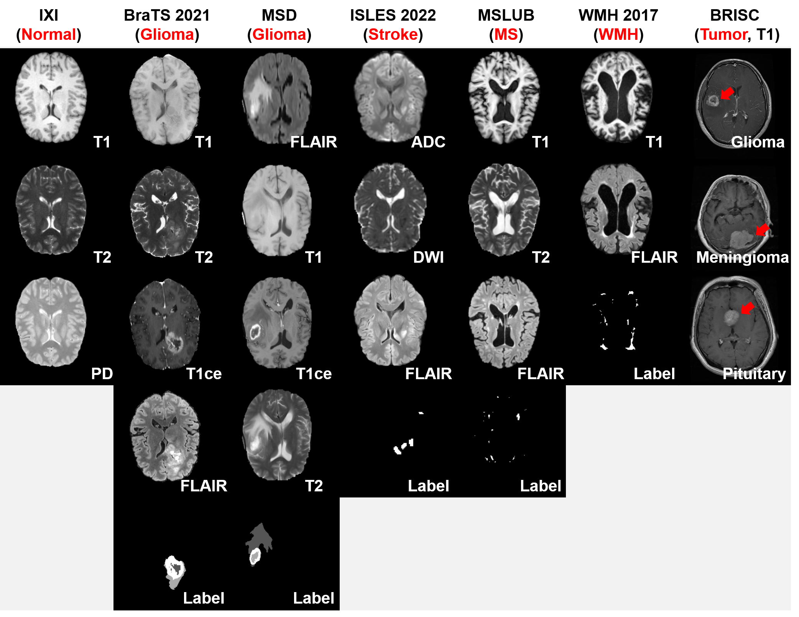
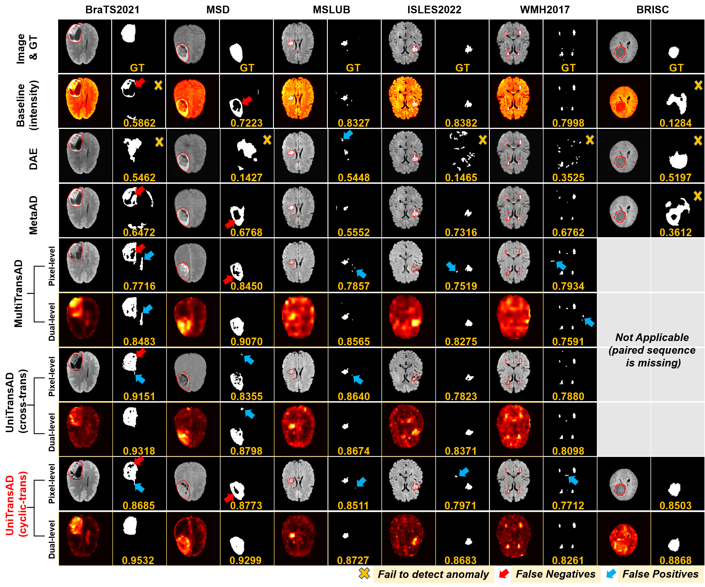

# UniTransAD: Universal Translation Framework for Anomaly Detection in Brain MRI
Official PyTorch implementation of UniTransAD, as presented in our paper submitted to IEEE TMI: **"UniTransAD: Universal Translation Framework for Anomaly Detection in Brain MRI".**

## Abstract 
Unsupervised anomaly detection (UAD) in brain MRI is crucial for early diagnosis but remains challenging due to diverse diseases, varying acquisition protocols, and missing sequences. We propose **UniTransAD**, a universal framework that realizes a **"train once, apply anywhere"** paradigm.
Key innovations include:
1. **Sequence-Agnostic Disentanglement**: A unified architecture that decouples anatomical content from sequence-specific style, allowing processing of arbitrary MRI sequences.
2. **Dynamic Style Prototype Memory (DSPM)**: A memory bank that dynamically learns global style prototypes during training, enabling a robust cyclic-inference mechanism for single-sequence inputs without requiring paired data.
3. **Dual-Level Detection**: A detection mechanism that combines pixel-level translation errors ($\mathcal{A}^{pixel}$) with feature-level content dissimilarities ($\mathcal{A}^{feature}$) to maximize sensitivity while suppressing false positives.
4. **Brain-OmniA Benchmark**: A large-scale benchmark aggregating 7 datasets (BraTS, MSD, ISLES, etc.) to rigorously evaluate generalization.

<table border="0">
  <tr>
    <td width="50%" align="center" style="border: none;">
      
      <br>
      <sub style="font-size: 13px; color: #666;">(a) Unified Training with DSPM and Content-Style Disentanglement</sub>
    </td>
    <td width="50%" align="center" style="border: none;">
      
      <br>
      <sub style="font-size: 13px; color: #666;">(b) Cyclic-Translation Inference and Dual-Level Detection</sub>
    </td>
  </tr>
</table>

## Project Structure
```
UniTransAD/
├── configs/                # Configuration classes (options.py)
├── data/                   # Dataset loaders and utils
│   └── dataset.py          # BrainOmniADataset implementation
├── models/                 # Model definitions
│   ├── unitransad.py       # Core UniTransAD model & DSPM
│   └── pos_embed.py        # Positional embedding helpers
├── preprocessing/          # Preprocessing scripts for Brain-OmniA
│   ├── preprocess_brats.py
│   ├── utils.py            # Normalization & slicing utils
│   └── ...
├── utils/                  # Visualization and helper tools
├── tuning_results/         # Generated by tune.py
├── weight/                 # Saved model checkpoints
├── train.py                # Main training script (DDP)
├── tune.py                 # Hyperparameter tuning script
├── evaluate.py             # Final evaluation script
└── requirements.txt        # Python dependencies
```

## Requirements
The code is tested with Python 3.8+ and PyTorch 1.12+.
```bash
pip install -r requirements.txt
```

## Brain-OmniA Data Preparation
We utilize the [Brain-OmniA benchmark](./img/Figure_2.png). You can download the dataset from [here](https://huggingface.co/datasets/ZhangqiSJTU/Brain-OmniA). The data preparation consists of three steps: converting to 2D slices, selecting healthy samples, and generating edge maps.


1. Preprocess Datasets (NIfTI to 2D .npy)
Use the scripts in preprocessing/ to convert 3D volumes into 2D axial slices. Example for BraTS 2021:
```bash
python preprocessing/preprocess_brats.py \
  --src_path /path/to/BraTS2021_TrainingData \
  --train_output ./datasets/npy/BraTS2021/train \
  --test_output ./datasets/npy/BraTS2021/test \
  --eval_output ./datasets/npy/BraTS2021/eval
```

2. Select Normal Slices
For training, we only use healthy slices. Use select_normal_slices.py to filter out slices containing lesions (Label > 0).
```bash
python preprocessing/select_normal_slices.py \
  --source_path ./datasets/npy/BraTS2021/train \
  --dest_path ./datasets/npy/BraTS2021/train_normal
  ```

3. Generate Edge Maps
UniTransAD uses edge guidance. Generate Sobel edge maps for both training and testing data.
```bash
python preprocessing/generate_edges.py \
  --input_folder ./datasets/npy/BraTS2021/train_normal \
  --output_folder ./datasets/npy/BraTS2021/train_normal_edge
```
Directory Layout Requirement: Ensure your data path matches the config in `train.py` (e.g., `train_normal` and `train_normal_edge`).

## Usage
1. Unified Training
Train the model using Distributed Data Parallel (DDP). The DSPM is updated online. Note: Ensure you update the `datasets_config` path in `train.py` before running.
```bash
# Example: Train on 4 GPUs
python -m torch.distributed.launch --nproc_per_node=4 train.py \
  --task_name UniTransAD_Run1 \
  --batch_size 8 \
  --epoch 15 \
  --lr 1e-3 \
  --ema_momentum 0.01
```

2. Hyperparameter Tuning
The tune.py script automatically finds the best model checkpoint and optimizes post-processing parameters (Median Filter size & Connected Component threshold) on the validation set.

*Ensure your validation set path matches the dataset config in `tune.py`.*
```bash
python tune.py \
  --models_dir ./weight/UniTransAD_Run1 \
  --results_dir ./tuning_results \
  --sample_size 500 \
  --cuda_device cuda:0
```
*Output*: A tuning_results_cycle.json file containing optimal parameters.

3. Final EvaluationRun the cyclic-translation inference to generate the Dual-Level Anomaly Map ($A_{final} = A^{pixel} \odot A^{feature}$) and calculate metrics.
```bash
python evaluate.py \
  --tuning_results_json ./tuning_results/tuning_results_cycle.json \
  --results_dir ./final_evaluation_results \
  --cuda_device cuda:0
```

## Results
UniTransAD achieves state-of-the-art performance on the Brain-OmniA benchmark:

<style>
.center 
{
  width: auto;
  display: table;
  margin-left: auto;
  margin-right: auto;
}
</style>
<div class="center">

| Method | BraTS2021 | MSD | MSLUB | ISLES 2022 | WMH 2017 | BRISC | Avg. Dice |
| :--- | :---: | :---: | :---: | :---: | :---: | :---: | :---: |
| DAE | 0.5342 | 0.1427 | 0.1143 | 0.1465 | 0.1611 | 0.5197 | 0.2698 |
| MetaAD | 0.6541 | 0.6624 | 0.3622 | 0.3101 | 0.4597 | 0.3612 | 0.4783 |
| MultiTransAD | 0.6615 | 0.6698 | 0.4154 | 0.2673 | 0.4593 | - | 0.4909 |
| **UniTransAD** | **0.7021** | **0.6965** | **0.5031** | **0.4658** | **0.5435** | **0.5659** | **0.5798** |
</div>


