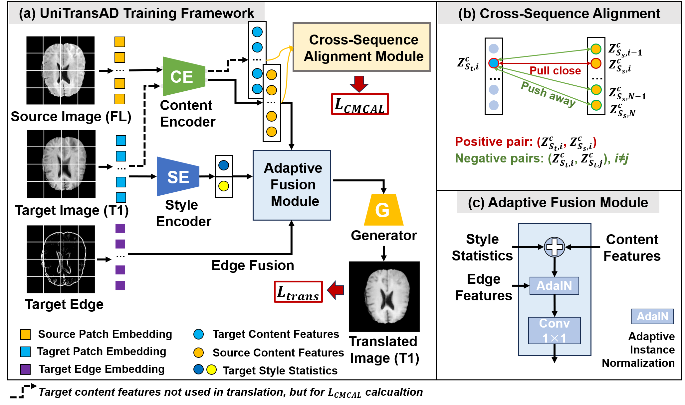
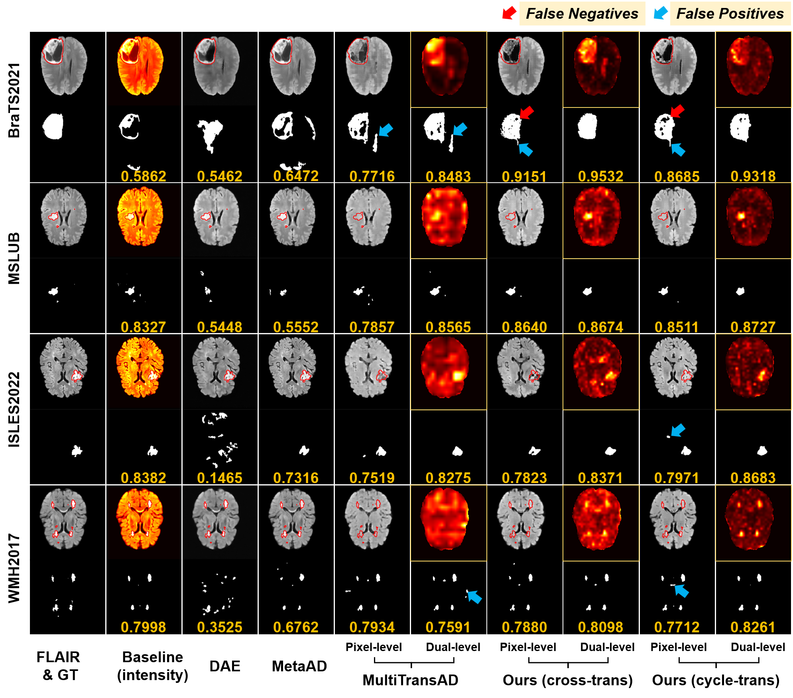

# UniTransAD: Unified Translation Framework for Anomaly Detection in Brain MRI

This repository provides the official implementation for the paper **"UniTransAD: Unified Translation Framework for Anomaly Detection in Brain MRI"**.

UniTransAD is a novel unsupervised anomaly detection (UAD) framework designed for the complexities of brain MRI. It addresses common UAD challenges by introducing:

1.  **Sequence-Agnostic Architecture:** A unified model trained on heterogeneous datasets (e.g., BraTS, IXI) that can process arbitrary MRI sequences.
2.  **Dual-Mode Inference:** Flexibly handles both paired, multi-sequence data (using *cross-sequence translation*) and single-sequence data (using *cyclic translation* with pre-calculated average styles).
3.  **Dual-Level Detection:** Combines pixel-level translation errors with feature-level content dissimilarities to enhance both sensitivity and specificity, effectively reducing false positives.

We also introduce the **Brain-OmniA** benchmark, which aggregates five public datasets (IXI, BraTS 2021, ISLES 2022, WMH 2017, MSLUB) to enable rigorous evaluation of model generalization across four distinct brain pathologies.

## Framework Overview

The core idea of UniTransAD is to disentangle anatomical **content** from sequence-specific **style**. The model is trained on healthy data to translate the content of a source sequence into the style of a target sequence. Anomalies are detected as regions where this translation fails, resulting in high pixel-level errors and high feature-level dissimilarities.

 

## Requirements

The code was tested with Python 3.9. To install the required dependencies, run:

```bash
pip install -r requirements
```

## Requirements
The end-to-end workflow consists of four main stages: Data Preprocessing, Training, Hyperparameter Tuning, and Final Evaluation.

### Step 1: Data Preprocessing

All preprocessing scripts are located in the preprocessing/ directory. The goal of this stage is to convert 3D NIfTI volumes (.nii.gz) from various datasets into a unified format: 2D axial slices saved as .npy files.

#### Convert NIfTI to 2D .npy Slices
Use the scripts in the preprocessing/ folder to process each of your datasets. You will need to modify the base_folder and output paths (train_path, test_path) inside each script.

Each script performs intensity normalization, co-registration (if needed), cropping, and 2D axial slice extraction.

#### Select Normal (Healthy) Slices

The model must be trained only on healthy, anomaly-free data. For datasets like BraTS, which contain anomalies, use preprocessing/select_normal.py to filter the training set. This script copies only the .npy slices where the label channel is empty (or below a small threshold) into a new "normal" directory.

```bash 
python preprocessing/select_normal.py \
    --source_path /mnt/sdb/zq/brain_sas_baseline/datasets/npy/BraTS2021/train/ \
    --dest_path /mnt/sdb/zq/brain_sas_baseline/datasets/npy/BraTS2021/train_normal
```

#### Generate Edge Maps
The UniTransAD model uses anatomical edge information to guide the translation. Use preprocessing/edge_generate.py to create edge maps for all your .npy datasets (both training and evaluation sets).

```bash 
# Example for the healthy BraTS training set
python preprocessing/edge_generate.py \
    --input_folder /mnt/sdb/zq/brain_sas_baseline/datasets/npy/BraTS2021/train_normal \
    --output_folder /mnt/sdb/zq/brain_sas_baseline/datasets/npy/BraTS2021/train_normal_edge

# Example for the BraTS evaluation set
python preprocessing/edge_generate.py \
    --input_folder /mnt/sdb/zq/brain_sas_baseline/datasets/npy/BraTS2021/eval \
    --output_folder /mnt/sdb/zq/brain_sas_baseline/datasets/npy/BraTS2021/eval_edge
```

After this step, your directory structure should look like this:
```bash
/path/to/your/datasets/npy/
├── BraTS2021/
│   ├── train/
│   ├── train_normal/         (Output of 1b)
│   ├── train_normal_edge/    (Output of 1c)
│   ├── eval/
│   ├── eval_edge/            (Output of 1c)
│   ├── test/
│   └── test_edge/            (Output of 1c)
├── IXI/
│   ├── train/
│   └── train_edge/           (Output of 1c)
├── ISLES/
│   ...
└── ...
```

### Step 2: Training

The model is trained using a "dataset roller" strategy, mixing batches from multiple healthy datasets (e.g., IXI and BraTS-normal). We use Distributed Data Parallel (DDP) for multi-GPU training.

Configure the datasets_config list in train_any_DDP.py (lines 53-67) to point to your healthy training data (train_normal) and their corresponding edge maps (train_normal_edge).

Run the training script. The following command launches training on 4 GPUs:

```bash
python -m torch.distributed.launch --nproc_per_node=4 train_any_DDP.py \
    --epoch=50 \
    --batch_size=8 \
    --lr=3e-3 \
    --decay_epoch=10 \
    --weight_save_path=./checkpoints/ \
    --logs_path=./logs/ \
    --img_save_path=./train_vis/
```

Model checkpoints (.pth files) will be saved in the --weight_save_path directory.


### Step 3: Hyperparameter Tuning (Validation)

After training, use hyperparameter_tuning.py to evaluate all model checkpoints on your validation sets. This script automatically:

Runs inference (using the cyclic-translation mode) for each model on each validation set.

Finds the single best-performing model (based on average Dice) across all datasets.

Finds the optimal post-processing hyperparameters (median filter size and connected component size) for that best model on each dataset.

```bash
python hyperparameter_tuning.py \
    --models_dir=./checkpoints/ \
    --results_dir=./tuning_results_cycle \
    --cuda_device=cuda:0
```

This script will output a tuning_results_cycle.json file in the --results_dir. This JSON file contains the path to the best model and the optimal parameters needed for the final evaluation.

### Step 4: Final Evaluation (Test)

Finally, use final_evaluation.py to run inference on the test sets. This script loads the best model and optimal parameters from the .json file generated in Step 3.
```bash
python final_evaluation.py \
    --tuning_results_json=./tuning_results_cycle/tuning_results_cycle.json \
    --results_dir=./final_evaluation_results \
    --cuda_device=cuda:0 \
    --save_sample_dice=True
```

This will generate:

final_evaluation_cycle_report.txt: A text report with the final metrics (5-fold CV Dice, AUROC, AUPRC) for each dataset.

final_sample_dice_cycle_report.xlsx: (If --save_sample_dice=True) An Excel file containing the per-sample Dice scores for further analysis.

## Results

### Quantitative results

### Qualitative results
 
